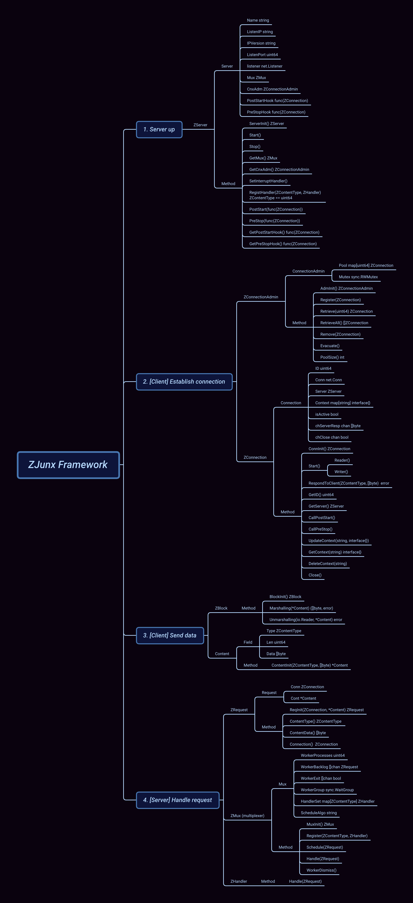

# ZJunx

A pure Go (using standard library only) light-weight TCP Server Framework with TLS enabled working at full duplex, which makes it ideal for some realtime implementations, such as instant messaging, video conference, collaborative editing, online games, realtime monitoring(stock, GPS, vital signs etc.) ...

## TODO 
Add a schema here to explain how it works

## About server
- To instantiate this framework, we need to prepare the handlers (according to what we want to implement) to handle the client's request, and register them to the instance. It's also possible to register the hooks before/after the connection is established/terminated.
```bash
server.RegistHandler(encoding.ZContentType(<ID>), &YourHandler{})
server.PreStop(<YourCallbackFunc>)
```
- the server read a config file at /etc/zjunx/zjunx.cfg, if not present it will run with the default. It's possible to pass the options to override all.
```bash
The following options can be passed to the server:
  -a string
    	Algorithm used to distribute job to worker, in [RoundRobin, Random, LeastConn] (default "RoundRobin")
  -c uint
    	Max connections allowed (default 128)
  -l string
    	IP server listens on (default "0.0.0.0")
  -n string
    	Server name (default "Zjunx Server")
  -p uint
    	IP port listens on (default 8080)
  -s uint
    	Size of queue per worker (default 1)
  -w uint
    	Number of worker (default 1)
```

## About client 
- The request's content sent by client should follow the same convention as the handler's. 

## Example
A reference implementation zjchat is available [here](https://github.com/ZhengjunHUO/zjchat)

## Structs and Funcs

